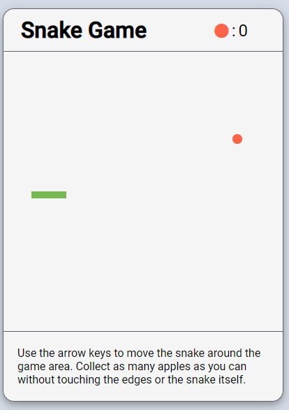

# Snake Game

*Classic snake game written in vanilla javascript.*

Try it [here](https://bcherrera14.github.io/snake-game/)

## Summary

I used Javascript, HTML, and CSS to create the classic snake game. The game uses the arrow keys to move the snake around the screen in order to collect the apples that appear. I learned how to manipulate canvas elements using javascript and how to simulate movement using the setInterval function.

## Author

* **Bryan Herrera** - *Full-Stack Developer* - Website | [LinkedIn](https://www.linkedin.com/in/herrerabryan/)  